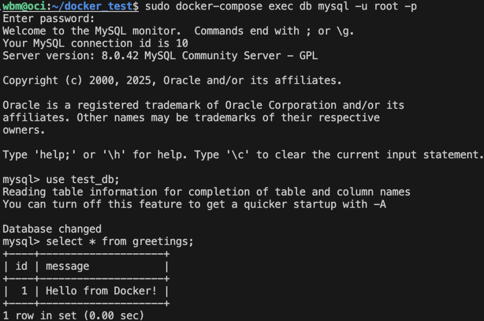

# 도커 연습
[블로그 정리글](https://blog.naver.com/ljh3047063/223712694485)
- [Dockerfile](Dockerfile)
- [docker-compose.yml](docker-compose.yml)


# 빌드 방법
```sh
sudo docker compose build
sudo docker compose up
```
localhost:30309 로 접속

# DB 확인방법
```sh
sudo docker compose exec db mysql -u root -p
# 비밀번호: password
use test_db;
select * from greetings;
```
